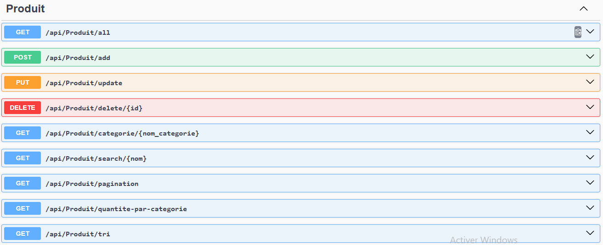

# Gestion_Catalogue_prod.Api
API REST développée en **ASP.NET Core** pour la gestion d’un catalogue de produits. Ce projet met en œuvre les concepts suivants :

- 🔁 Requêtes LINQ (filtrage, tri, groupement)
- 🔗 Relation **One-to-Many** entre entités (`Categorie` ↔ `Produit`)
- 📄 Pagination
- 🔍 Recherche et tri dynamiques
- 💾 Opérations CRUD complètes

## 🎯 Objectifs pédagogiques

- Se familiariser avec les **requêtes LINQ** en C#
- Comprendre et implémenter une **relation One-to-Many** en base de données
- Pratiquer les **opérations CRUD**
- Intégrer **la pagination manuelle ou automatique**
- Maîtriser les **fonctions de tri et de recherche dynamiques**

## 🛠️ Technologies utilisées

- **.NET 8**
- **Entity Framework Core**
- **LINQ**
- **C#**
- **SQL Server** (ou autre SGBD relationnel)
  ## ⚙️ Fonctionnalités

- ✅ **CRUD Catégorie** (Créer, Lire, Mettre à jour, Supprimer)
- ✅ **CRUD Produit**
- ✅ **Afficher les produits par catégorie**
- ✅ **Tri dynamique** des produits par :
  - Nom (ascendant/descendant)
  - Prix (ascendant/descendant)
  - Quantité (ascendant/descendant)
- ✅ **Recherche par nom** de produit
- ✅ **Pagination** (5 ou 10 produits par page)
- ✅ **Quantité totale des produits par catégorie** (`GroupBy` avec LINQ)

## 📁 Structure du projet

- `Gestion_Catalogue_prod.Api/` : Projet principal de l'API
- `Gestion_catalogue_prod.Domaine.Core/` : Contient les entités du domaine (`Categorie`, `Produit`)
- `Gestion_catalogue_prod.Infrastructure.Core/` : Contient le contexte de base de données et les configurations
  ## 💡 Captures de la documentation Swagger
  ### les endpoints Category
  
  ### les endpoints produit
  
  ### Quantite total produit par nom category
  
  
  ## 🚀 Lancer le projet

1. Cloner le dépôt :

   ```bash
   git clone https://github.com/kelly-alphador/Gestion_Catalogue_prod.Api.git
   cd Gestion_Catalogue_prod.Api
2. Restaurer les dépendances :
   ```bash
   dotnet restore
3. Appliquer les migrations et créer la base de données : 
   ```bash
   dotnet ef database update -p Gestion_catalogue_prod.Infrastructure.Core -s Gestion_Catalogue_prod.Api
4. Démarrer l'application :
   ```bash
   dotnet run
